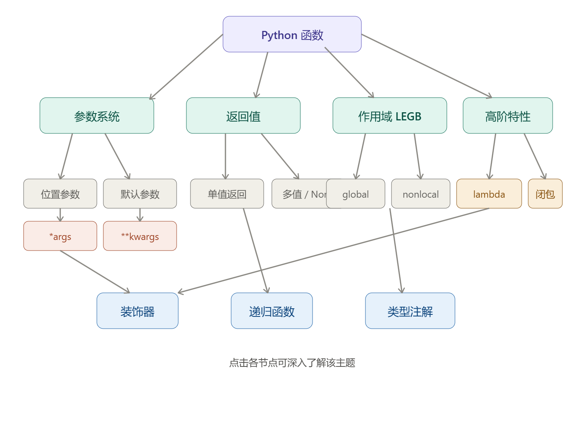

# 函数

Python 中的函数（Function）是组织好的、可重复使用的、用来实现单一或相关联功能的代码段。
使用函数可以提高代码的模块性和代码的重复利用率

> 我们可以把函数看作一个“加工厂”：输入原料（参数），进行加工（执行代码），最后输出产品（返回值）



### 1. 函数的基础：定义与调用

在 Python 中，使用 `def` 关键字来定义函数。

```python
def 函数名(参数1, 参数2, ...):
    """函数文档字符串（可选，用于解释函数功能）"""
    # 函数体（要执行的代码）
    return 返回值  # （可选）
```

---

### 2.函数命名规范

函数命名推荐使用：`小写字母、数字、下划线，蛇形命名（snake_case）`。

```python
get_name()

find_user()

calculate_sum()

send_email()

get_user_info()
```

实际上，在 Python 中，不止函数，其他的命名规范如下：

| 标识符类型                  | 命名风格              | 示例                                 | 说明                   |
|------------------------|-------------------|------------------------------------|----------------------|
| 函数（Functions）          | 蛇形命名（snake_case）  | `describe_pet()`、`get_user_info()` | 全部小写，单词间用下划线 `_` 分割  |
| 变量（Variables）          | 蛇形命名（snake_case）  | `pet_name`、`user_id`               | 与函数一致                |
| 类（Classes）             | 大驼峰（PascalCase）   | `PetController`、`UserProfile`      | 每个单词首字母大写，不使用下划线     |
| 常量（Constants）          | 全大写蛇形（UPPER_CASE） | `MAX_CONNECTIONS`、`PI`             | 全部大写，单词间用下划线分割       |
| 模块/包（Modules/Packages） | 全小写               | `os`、 `sys`、`my_package`           | 尽量简短，不推荐使用下划线（除非必要）。 |

---

### 3. 函数的参数（重点）

Python 的参数机制非常灵活，主要分为以下几种：

#### 1. 位置参数（Positional Arguments）

调用函数时，根据参数定义的**顺序**依次传入值。数量和顺序必须一致。

```python
def power(x, n):
    return x**n


print(power(2, 3))  # 2的3次方，输出 8
```

#### 2. 关键字参数（Keyword Arguments）

调用函数时，通过 `参数名 = 值` 的形式传递。这样可以不按顺序传递参数。

```python
def describe_pet(pet_name, animal_type):
    print(f"我有一只 {animal_type}，它的名字叫 {pet_name}。")


# 顺序乱了也没关系，因为指定了参数名
describe_pet(animal_type="猫咪", pet_name="小白")
# 输出: 我有一只 猫咪，它的名字叫 小白。
```

#### 3. 默认参数（Default Arguments）

在定义函数时，可以为参数指定默认值。如果调用时没有传这个参数，就使用默认值。

⚠️ **注意**：默认参数必须放在位置参数的后面。

```python
def enroll(name, gender, city="北京"):
    print(f"姓名: {name}, 性别: {gender}, 城市: {city}")


enroll("张三", "男")  # 城市使用默认值：北京
enroll("李四", "女", "上海")  # 覆盖默认值，城市变为：上海
```

#### 4. 可变参数（不定长参数）

如果你知道用户会传入多少个参数，可以使用可变参数。

- `*args（元组可变参数）`：接收任意多个**位置参数**，并在函数内部打包成一个元组（tuple）
- `**kwargs（字典可变参数）`：接收任意多个**关键字参数**，并在函数内部打包成一个字典（dict）`

```python
def total_score(name, *args, **kwargs):
    print(f"学生: {name}")
    print(f"各科分数 (元组): {args}")
    print(f"其他信息 (字典): {kwargs}")


total_score("小明", 90, 85, 95, 班级="一班", 老师="王老师")
# 输出:
# 学生: 小明
# 各科分数 (元组): (90, 85, 95)
# 其他信息 (字典): {'班级': '一班', '老师': '王老师'}
```

#### 5. 参数的顺序

在 Python 中，定义函数时参数的声明顺序有着极其严格的语法要求。如果顺序写错，Python 解释器在编译时会直接报 `SyntaxError`
（语法错误）。

完整的参数定义顺序规则（从左到右）如下：

```tex
位置参数（必选参数） -> 默认参数（缺省参数） -> 可变位置参数（*args） -> 命名关键字参数 -> 可变关键字参数
```

标准顺序模板：

```python
def complex_function(a, b, c=10, *args, d, e=20, **kwargs):
    """
    a, b      : 位置参数（必须传）
    c         : 默认参数（可不传，有默认值）
    *args     : 可变位置参数（接收多余的位置参数，打包为元组）
    d         : 命名关键字参数（必须用 d=xxx 的形式传参）
    e         : 带默认值的命名关键字参数
    **kwargs  : 可变关键字参数（接收多余的关键字参数，打包为字典）
    """
    pass
```

**为什么是这个顺序？**

为了保证 Python 解释器在调用函数时，能够唯一、无歧义地将实参分配给形参：

- 位置参数必须在默认参数前面： 如果允许 def func(a=1, b)，那么当你调用 func(2) 时，解释器无法判断 2 是想传给 a 覆盖默认值，还是想传给
  b。因此，必选的位置参数必须排在最前面。
- *args 必须在 **kwargs 前面： 因为位置传参先于关键字传参解析
- 命名关键字参数（Keyword-Only）： 任何放在 *args 之后的普通参数（如上文模板中的 d 和
  e），在调用时强制必须使用关键字形式传参。因为所有多余的位置实参都会被 *args 吞掉，如果不强制用关键字传参，后面的参数将永远无法接收到值

---

### 4. 函数的返回值（return）

- 函数通过 `return` 语句将结果返回给调用者，并**立即结束**函数的执行。
- 如果函数没有 `return`，或者只写了 `return` 后面没接内容，函数默认返回 `None`。
- 函数**可以返回多个值**，实际返回了一个元组（tuple）

```python
def get_max_and_min(numbers):
    if not numbers:
        return None  # 空列表直接返回 None
    return max(numbers), min(numbers)  # 返回多个值


res = get_max_and_min([12, 5, 23, 89, 3])
print(res)

# 也可以用多个变量直接解包接收
highest, lowest = get_max_and_min([12, 5, 23, 89, 3])
print(highest)
```

---

### 5. 变量的作用域

- 局部变量（Local）：在函数内部定义的变量，只能在函数内部使用
- 全局变量（Global）：在函数外部定义的变量，整个代码文件都可以访问

> 修改全局变量：如果想在函数内部修改全局变量，需要使用 global 关键字

> 不过，实际开发中尽量避免使用 global 修改全局变量，因为会增加代码耦合度，影响可维护性。更推荐通过参数传递和返回值来共享数据。

```python
count = 10  # 全局变量


def modify_count():
    global count  # 声明我们要修改全局变量 count
    count = 20
    local_var = 5  # 局部变量


modify_count()
print(count)  # 输出 20 (已被修改)
# print(local_var)  # 报错！函数外部无法访问局部变量
```

#### 1. 作用域 LEGB 规则

Python 变量查找顺序：**L**ocal → **E**nclosing → **G**lobal → **B**uilt-in。

```python
x = "global"  # G


def outer():
    x = "enclosing"  # E

    def inner():
        x = "local"  # L
        print(x)  # 打印 "local"

    inner()


outer()
print(x)  # 打印 "global"
```

**什么是 LEGB 规则？**

**LEGB 规则**是 Python 解释器在查找变量（名字解析）时的**搜索顺序**。

当在代码中使用一个变量时，Python 会按照 L -> E -> G -> B 的顺序，由内而外依次在不同的作用域（Scope）中寻找该变量。如果在四个作用域中都没找到，就会抛出 `NameError`。

**LEGB 作用域的含义：**

| 字母           | 作用域名称 | 解释与范围                                                   | 示例               |
| -------------- | ---------- | ------------------------------------------------------------ | ------------------ |
| L（Local）     | 局部作用域 | 函数或方法内部定义的变量（包括参数）。每次调用函数时创建，调用结束销毁。 | 函数内部的 `x = 1` |
| E（Enclosing） | 嵌套作用域 | 嵌套函数中，外层非全局函数的局部作用域（常用于闭包）。       | 外层函数的 `x = 2` |
| G（Global）    | 全局作用域 | 模块（文件）顶层定义的变量。从文件被加载开始，到程序结束运行。 | 文件顶层的 `x = 3` |
| B（Built-in）  | 内置作用域 | Python 系统预先定义好的函数和类（例如 `len`, `max`, `print` ）。 | 系统内置的 `len`   |

**示例及搜索顺序分析：**

```python
# 4. Built-in 作用域：例如 Python 的内置函数 input, len 等

x = "Global x"  # 3. Global 作用域：定义在文件顶层


def outer_func():
    x = "Enclosing x"  # 2. Enclosing 作用域：对外层函数是局部，对内层函数是嵌套

    def inner_func():
        x = "Local x"  # 1. Local 作用域：定义在最内层函数内部

        print(x)  # 寻找 x 的值

    inner_func()


outer_func()


"""
搜索顺序分析：
当 print(x) 执行时，Python 寻找 x 的过程如下：
1. L (Local)：先检查 inner_func 内部。找到了 x = "Local x"，直接使用。
2. E (Enclosing)：如果把第 10 行注释掉，L 找不到。Python 会往外层找，在 outer_func 里找到了 x = "Enclosing x"。
3. G (Global)：如果把第 7 行和第 10 行都注释掉，L 和 E 都找不到。Python 会去文件最外层（全局）找，找到了 x = "Global x"。
4. B (Built-in)：如果把顶层的 x 也注释掉，Python 会去内置命名空间找（虽然没有叫 x 的内置函数，但如果打印的是 len，就会在这里被找到）。
5. 报错：如果上述 4 处都找不到，抛出 NameError: name 'x' is not defined。
"""
```

**如何在 Local 中修改外层作用域中的变量？**

默认情况下，局部作用域**只能读取**外层作用域的变量，无法直接修改。如果尝试修改，Python 会将其当成一个新的局部变量来创建。

可以使用 `global` 和 `nonlocal` 关键字来修改

1. `global`：在函数内修改全局变量（G）

   ```python
   count = 0


   def increment():
       global count  # 声明：我要使用的是全局变量 count
       count += 1  # 成功修改全局变量


   increment()
   print(count)  # 输出: 1
   ```

2. `nonlocal`：在内层函数修改外层嵌套变量（E）

   ```python
   def outer():
       num = 10

       def inner():
           nonlocal num  # 声明：我要使用的是外层 Enclosing 作用域的变量 num
           num = 20  # 成功修改外层变量

       inner()
       print(num)  # 输出: 20


   outer()
   ```

> WARNING：**避免命名遮蔽（Shadowing）** 不要将你的变量或函数命名为与 **Built-in** 相同的内容（例如 `len = 10` 或 `list = [1, 2]`）。这会导致全局作用域的变量遮蔽了内置作用域的函数，使得后续调用 `len()` 或 `list()` 时报错 `TypeError: 'int' object is not callable`。

---

### **知识体系总结图**

```python
Python 函数
├── 基础: def / return / docstring
├── 参数: 位置 / 默认 / *args / **kwargs / keyword-only
├── 作用域: LEGB / nonlocal / global
├── 高级特性
│   ├── 闭包 (Closure)
│   ├── Lambda
│   ├── 装饰器 (Decorator)
│   └── 生成器 (Generator / yield)
├── 函数式编程: map / filter / reduce / functools
└── 工程实践: Type Hints / @wraps / 单一职责
```

